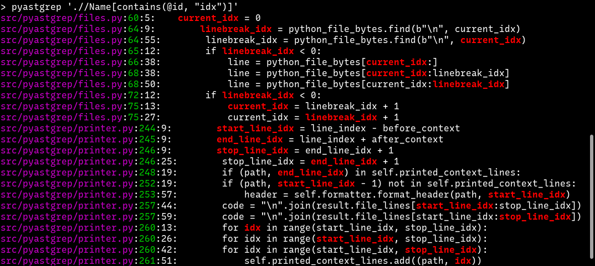

===========
Basic usage
===========

.. code-block:: shell

    pyastgrep <xpath expression> [files or directories]

You can omit files or directories and the current directory (and
sub-directories) will be searched. It’s designed to be used like `ripgrep
<https://github.com/BurntSushi/ripgrep/>`_.

See ``pyastgrep --help`` for more command line options.

pyastgrep in action
===================

Here is an example showing everywhere in the ``pyastgrep`` code base that uses a
variable whose name contains ``idx``:

Some highlights:

- for multiple matches within a line, it prints a separate result for each one.
- colouring and formatting is the same as ripgrep’s defaults.
- like ripgrep, it also intelligently ignores files in your ``.gitignore`` etc.

Understanding the XML structure
===============================

To get started, you’ll need some understanding of how Python AST is structured,
and how that is mapped to XML. Some methods for doing that are below:

1. Use `Python AST Explorer <https://python-ast-explorer.com/>`_ to play around
   with what AST looks like.

2. Dump out the AST and/or XML structure of the top-level statements in a Python
   file. The easiest way to do this is to use the provided ``pyastdump``
   command, passing in either a Python filename, ``pyastdump yourfile.py``, or
   piping in Python fragments as below:

   .. code-block:: shell

      $ echo 'x = 1' | pyastdump -
      <Module>
        <body>
          <Assign lineno="1" col_offset="0">
            <targets>
              <Name lineno="1" col_offset="0" type="str" id="x">
                <ctx>
                  <Store/>
                </ctx>
              </Name>
            </targets>
            <value>
              <Constant lineno="1" col_offset="4" type="int" value="1"/>
            </value>
          </Assign>
        </body>
        <type_ignores/>
      </Module>

   (When piping input in this way, code will be automatically dedented, making
   this easier to do from partial Python snippets.)

   You can also use the ``pyastgrep`` command, but since the top-level XML
   elements are ``<Module><body>``, and don’t correspond to actual source lines,
   you’ll need to use an XPath expression ``./*/*`` to get a match for each
   statement within the body, and pass ``--xml`` and/or ``--ast`` to dump the
   XML/AST structure:

   .. code-block:: shell

      $ pyastgrep --xml --ast './*/*' myfile.py
      myfile.py:1:1:import os
      Import(
          lineno=1,
          col_offset=0,
          end_lineno=1,
          end_col_offset=9,
          names=[alias(lineno=1, col_offset=7, end_lineno=1, end_col_offset=9, name='os', asname=None)],
      )
      <Import lineno="1" col_offset="0">
        <names>
          <alias lineno="1" col_offset="7" type="str" name="os"/>
        </names>
      </Import>
      ...

Note that the XML format is a very direct translation of the Python AST as
produced by the `ast module <https://docs.python.org/3/library/ast.html>`_ (with
some small additions made to improve usability for a few cases). This AST is not
stable across Python versions, so the XML is not stable either. Normally changes
in the AST correspond to new syntax that is added to Python, but in some cases a
new Python version will make significant changes made to the AST generated for
the same code.

You’ll also need some understanding of how to write XPath expressions (see links
at the bottom), but the examples below should get you started.

Links
=====

- `Green tree snakes <https://greentreesnakes.readthedocs.io/en/latest/>`__ - a very readable overview of Python ASTs.
- `ast module documentation <https://docs.python.org/3/library/ast.html>`__.
- `Python AST Explorer <https://python-ast-explorer.com/>`__ for worked  examples of ASTs.
- A `brief guide to XPath <http://www.w3schools.com/xml/xpath_syntax.asp>`__.
  See also the `XPath Axes <https://www.w3schools.com/xml/xpath_axes.asp>`_ guide
  which can be very helpful for matching related AST nodes.
- `Online XPath Tester <https://extendsclass.com/xpath-tester.html>`_
